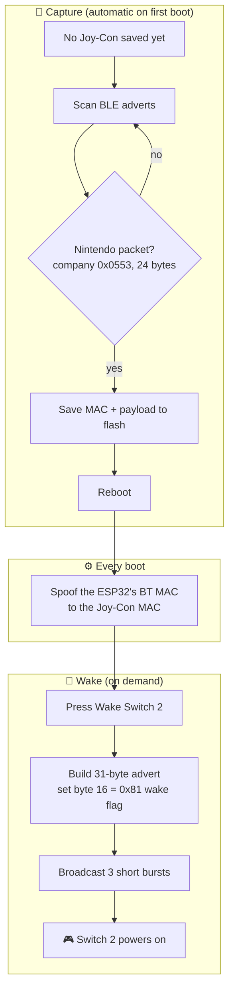

<div align="center">

# 🎮 ESPHome Switch 2 Wake Beacon

**Wake your Nintendo Switch 2 remotely from Home Assistant — no Pro Controller required.**

An ESP32 captures your Joy‑Con's Bluetooth identity, then impersonates it on demand to
power the console on.


[](https://github.com/sickyj/Switch2-Wake-Beacon-ESPHome/actions/workflows/build.yml)

<br/>

### 🙏 Credit

The Switch 2 BLE wake protocol and the 31‑byte payload were **reverse‑engineered by
[alexvnesta/switch2controller](https://github.com/alexvnesta/switch2controller)**.
This project is an ESPHome adaptation of that work — full credit for the hard part goes there.

</div>

---

## Contents

- [How it works](#how-it-works)
- [Hardware](#-hardware)
- [Requirements](#-requirements)
- [Install](#-install)
- [How to use](#-how-to-use)
- [Home Assistant entities](#home-assistant-entities)
- [Repository layout](#-repository-layout)
- [Troubleshooting](#-troubleshooting)
- [FAQ](#-faq)
- [Safety & legality](#-safety--legality)
- [Credits](#-credits)
- [License](#-license)

---

## How it works

A Switch 2 can be woken by a BLE advertisement that looks exactly like one from its own
paired Joy‑Con. Two things must match: the **Bluetooth MAC address** it comes from, and
the **Nintendo manufacturer payload** inside it. So the ESP32 works in two phases —
**learn** the Joy‑Con's identity, then **replay** it whenever you press a button.



Because the ESP32 wears the Joy‑Con's MAC at the hardware level, it advertises from a
**public** address and doesn't need to drop its Wi‑Fi/Home Assistant connection to do it.

## 🔌 Hardware

No wiring or extra components — just an ESP32 dev board powered over USB.

- Any **ESP32** works (developed on a DFRobot FireBeetle ESP32; ESP32‑WROOM boards are fine).
- Place it within Bluetooth range of the console; an external‑antenna board helps if it's far.
- Boards with the newer ESP32‑C/S variants also work as long as they run the **esp‑idf** framework.

## ✅ Requirements

| | |
|---|---|
| **Board** | Any **ESP32** (developed on a DFRobot FireBeetle ESP32; most ESP32 variants work) |
| **ESPHome** | **2024.11.0** or newer |
| **Framework** | **ESP‑IDF** — the Arduino BLE stack can't do raw advertising or hardware MAC spoofing |
| **Console** | Nintendo **Switch 2** with a paired **Joy‑Con 2** |

## 🚀 Install

Everything is pulled from GitHub — **nothing to download, no header to copy.** The whole
setup is: put your Wi‑Fi in `secrets.yaml`, paste a short config, and click **Install**.

### 1. Wi‑Fi secret

Copy [`secrets.yaml.example`](secrets.yaml.example) to `secrets.yaml` next to your config:

```yaml
wifi_ssid: "Your WiFi"
wifi_password: "Your Password"
```

### 2. The config

**Simplest — one import (recommended).** In ESPHome, add a new device and use this as the
*entire* config. The single `packages:` line pulls in everything else — the C++ component,
the wake/capture logic, Wi‑Fi, API, OTA, and the esp‑idf framework:

```yaml
substitutions:
  name: switch-wake-up
esphome:
  name: ${name}
esp32:
  board: esp32dev      # ← set your ESP32 board

packages:
  switch2_wake: github://sickyj/Switch2-Wake-Beacon-ESPHome/esp-home.yaml@v2.4.0
```

<details>
<summary><b>Or: add to a config you already have</b></summary>

Already running an **esp‑idf** ESP32 device? Add just these two blocks instead of importing
the whole example:

```yaml
external_components:
  - source: github://sickyj/Switch2-Wake-Beacon-ESPHome@v2.4.0

packages:
  switch2_wake:
    url: https://github.com/sickyj/Switch2-Wake-Beacon-ESPHome
    files: [switch2_master.yaml]
    ref: v2.4.0
    refresh: 1d
```
</details>

### 3. Install

Click **Install** in ESPHome and flash it (USB the first time, OTA after). There's nothing
else to configure — the device **captures automatically on first boot** (just hold **Home**
on your Joy‑Con), then you wake with one button. See [How to use](#-how-to-use).

> [!TIP]
> **Updates & pinning.** `@v2.4.0` pins to a release (stable); use `@main` for the latest.
> The project also ships a `dashboard_import`, so the ESPHome dashboard can offer one‑click
> **adopt** and flag new versions when the project version bumps.

> [!NOTE]
> **Why esp‑idf, and where's the C++?** The Arduino BLE stack can't do the raw advertising +
> hardware MAC spoof this needs, so esp‑idf is required. The `esp_mac.h` call lives in a tiny
> [external component](components/switch2) — which is how the C++ ships over a `github://`
> source with no local file.

### Tuning (optional)

Override any of these in your base config's `substitutions:` block — your values win:

| Substitution | Default | Meaning |
|---|---|---|
| `wake_flag_byte` | `0x81` | Byte 16, the wake‑trigger flag |
| `wake_bursts` | `3` | Number of advertisement bursts sent per wake |
| `capture_timeout` | `60s` | How long a capture attempt scans before giving up |
| `scan_active` | `false` | BLE scan mode; set `true` if capture never triggers (see Troubleshooting) |
| `auto_capture` | `true` | Auto‑capture on first boot when nothing is saved (see below) |
| `hide_advanced` | `true` | Hide the advanced/destructive controls by default (see below) |

## 🎮 How to use

### Step 1 — Capture (automatic)

The first time you power the device with no Joy‑Con saved, it **starts capturing on its own**.
Just **press & hold Home on your Joy‑Con 2** within ~60 s. The ESP32 grabs the BLE
advertisement, saves the MAC + payload, and **reboots** to apply the hardware MAC spoof —
no buttons to press. (If it times out, it tries again on the next boot.)

To capture again later (e.g. a different controller), enable the **Capture Mode** switch — it's
in the advanced entities. Set `auto_capture: "false"` if you'd rather always do it manually.

### Step 2 — Wake the console

Press **Wake Switch 2**. The ESP32 broadcasts the 31‑byte advertisement with the `0x81`
wake flag (three short bursts), and the console powers on. **Wake Status** reports the
result.

### Home Assistant entities

| Entity | Type | Shown? | What it does |
|---|---|---|---|
| **Wake Switch 2** | button | always | Broadcast the wake beacon (3 short bursts) |
| **Ready** | binary_sensor | always | On when the device can wake — a Joy‑Con is captured *and* the MAC spoof succeeded |
| **Wake Status** | sensor | always | Human‑readable status of the last action |
| **Capture Mode** | switch | 🔒 advanced | Re‑capture a Joy‑Con (first capture is automatic) |
| **Clear Saved Data** | button | 🔒 advanced | Wipe the saved payload/MAC and reboot to restore the real BT MAC |
| **Reboot Device** | button | 🔒 advanced | Restart the ESP32 |
| **Saved Nintendo Payload** | sensor | 🔒 advanced | The captured 24‑byte payload (hex) |
| **Saved Joy‑Con MAC** | sensor | 🔒 advanced | The captured Joy‑Con MAC |

> [!TIP]
> **Advanced mode.** With auto‑capture, a normal user only ever sees *Wake Switch 2* and
> *Wake Status*. The 🔒 entities (re‑capture, destructive, and raw‑data) are **hidden by
> default** — enable one on the device page in Home Assistant
> (**Settings → Devices → your device → +N entities not shown**), or set
> `hide_advanced: "false"` to reveal them all at build time.

## 📂 Repository layout

| File | Purpose |
|---|---|
| [`switch2_master.yaml`](switch2_master.yaml) | The wake/capture package — import this into your config |
| [`components/switch2/`](components/switch2) | ESPHome external component: the C++ that spoofs the BT MAC (`esp_mac.h`) |
| [`esp-home.yaml`](esp-home.yaml) | Example base config (board, Wi‑Fi, framework) showing how to wire it up |
| [`secrets.yaml.example`](secrets.yaml.example) | Template for your Wi‑Fi credentials — copy to `secrets.yaml` |
| [`CHANGELOG.md`](CHANGELOG.md) | Version history |
| [`tests/`](tests) · [`.github/workflows/build.yml`](.github/workflows/build.yml) | CI that compiles the project + validates the example config |

## 🔧 Troubleshooting

| Symptom | Fix |
|---|---|
| **Nothing captured** | Hold **Home** on the Joy‑Con during the ~60 s capture window (automatic on first boot; or enable **Capture Mode**). Only a 24‑byte Nintendo packet (company ID `0x0553`) is saved. Power‑cycle to retry. If it still never fires, set `scan_active: "true"` (some controllers only expose their data in a scan response). |
| **Ready stays off after capture** | The boot‑time MAC spoof failed — check the logs for a `switch2` error. **Ready** requires both a saved Joy‑Con *and* a successful spoof. |
| **Wake does nothing** | Check both the payload and MAC sensors are populated. If empty, run capture again. |
| **Want to start over** | Press **Clear Saved Data** — it wipes storage and reboots to restore the real BT MAC. |
| **Build fails on `switch2::spoof_bt_mac` / component not found** | Make sure the `external_components:` block is present (see [Install](#-install)). It supplies the C++ the package calls. |

## ❓ FAQ

**Does this need the Pro Controller 2?**
No — that's the point. It mimics a standard Joy‑Con 2.

**Will it disconnect the ESP32 from Home Assistant while advertising?**
No. The wake advert is a non‑connectable broadcast and Wi‑Fi stays up.

**Does spoofing the MAC permanently change my ESP32?**
No. The MAC is set in RAM at each boot; clearing saved data and rebooting restores the
factory BT MAC.

**Can one ESP32 wake multiple consoles?**
This build stores one Joy‑Con identity at a time. Re‑capture to switch targets.

## ⚠️ Safety & legality

This impersonates a Bluetooth identity to wake **hardware you own**. Use it only on your
own console and controller. Nothing here is affiliated with or endorsed by Nintendo.

## 🙏 Credits

- **Reverse engineering** of the Switch 2 BLE wake protocol and the 31‑byte payload
  structure: [alexvnesta/switch2controller](https://github.com/alexvnesta/switch2controller).
- **ESPHome adaptation** (YAML packaging + C++ lambda logic): originally generated with
  Google Gemini, then refined and verified to compile against ESP‑IDF.

## 📄 License

Released under the [MIT License](LICENSE).
