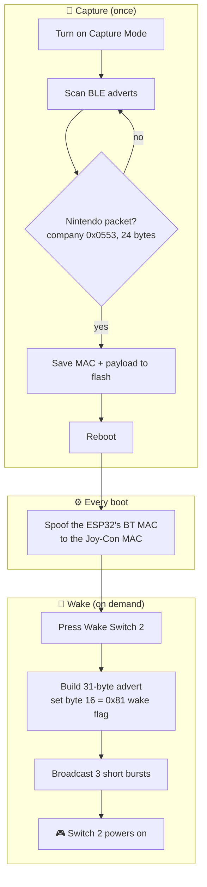

<div align="center">

# 🎮 ESPHome Switch 2 Wake Beacon

**Wake your Nintendo Switch 2 remotely from Home Assistant — no Pro Controller required.**

An ESP32 captures your Joy‑Con's Bluetooth identity, then impersonates it on demand to
power the console on.


[](https://github.com/sickyj/Switch2-Wake-Beacon-ESPHome/actions/workflows/build.yml)

<br/>

### 🙏 Credit

The Switch 2 BLE wake protocol and the 31‑byte payload were **reverse‑engineered by
[alexvnesta/switch2controller](https://github.com/alexvnesta/switch2controller)**.
This project is an ESPHome adaptation of that work — full credit for the hard part goes there.

</div>

---

## Contents

- [How it works](#how-it-works)
- [Hardware](#-hardware)
- [Requirements](#-requirements)
- [Install](#-install)
- [How to use](#-how-to-use)
- [Home Assistant entities](#home-assistant-entities)
- [Repository layout](#-repository-layout)
- [Troubleshooting](#-troubleshooting)
- [FAQ](#-faq)
- [Safety & legality](#-safety--legality)
- [Credits](#-credits)
- [License](#-license)

---

## How it works

A Switch 2 can be woken by a BLE advertisement that looks exactly like one from its own
paired Joy‑Con. Two things must match: the **Bluetooth MAC address** it comes from, and
the **Nintendo manufacturer payload** inside it. So the ESP32 works in two phases —
**learn** the Joy‑Con's identity, then **replay** it whenever you press a button.



Because the ESP32 wears the Joy‑Con's MAC at the hardware level, it advertises from a
**public** address and doesn't need to drop its Wi‑Fi/Home Assistant connection to do it.

## 🔌 Hardware

No wiring or extra components — just an ESP32 dev board powered over USB.

- Any **ESP32** works (developed on a DFRobot FireBeetle ESP32; ESP32‑WROOM boards are fine).
- Place it within Bluetooth range of the console; an external‑antenna board helps if it's far.
- Boards with the newer ESP32‑C/S variants also work as long as they run the **esp‑idf** framework.

## ✅ Requirements

| | |
|---|---|
| **Board** | Any **ESP32** (developed on a DFRobot FireBeetle ESP32; most ESP32 variants work) |
| **ESPHome** | **2024.11.0** or newer |
| **Framework** | **ESP‑IDF** — the Arduino BLE stack can't do raw advertising or hardware MAC spoofing |
| **Console** | Nintendo **Switch 2** with a paired **Joy‑Con 2** |

## 🚀 Install

1. **Download [`custom_mac.h`](custom_mac.h) into your ESPHome config folder** (the same
   directory as your device `.yaml`). This one‑line header makes `<esp_mac.h>` visible for
   the boot‑time MAC spoof, and ESPHome resolves it against *your* config directory — so it
   must live locally (see the note below).

2. Use [`esp-home.yaml`](esp-home.yaml) as a starting point, or add the package block to an
   existing **esp‑idf** ESP32 config. Copy [`secrets.yaml.example`](secrets.yaml.example) to
   `secrets.yaml` and fill in your Wi‑Fi details.

   ```yaml
   packages:
     switch2_wake:
       url: https://github.com/sickyj/Switch2-Wake-Beacon-ESPHome
       files: [switch2_master.yaml]
       ref: v1.0.0    # pin to a release, or use `main` for the latest
       refresh: 1d
   ```

3. Install / flash the firmware to your ESP32 from ESPHome.

> [!IMPORTANT]
> `custom_mac.h` **must** sit in your local config directory. ESPHome resolves a package's
> `includes:` against your config folder, not the remote repo, so it can't be pulled over
> the `url:` — download it once alongside your config. (This is the only manual file.)

### Tuning (optional)

Override any of these in your base config's `substitutions:` block — your values win:

| Substitution | Default | Meaning |
|---|---|---|
| `wake_flag_byte` | `0x81` | Byte 16, the wake‑trigger flag |
| `wake_bursts` | `3` | Number of advertisement bursts sent per wake |
| `capture_timeout` | `60s` | Auto‑disable Capture Mode after this long |

## 🎮 How to use

### Step 1 — Capture (do this once)

1. In Home Assistant, turn **ON** the **Capture Mode** switch.
2. Wake your controller by pressing & holding **Home** on the Joy‑Con 2.
3. The ESP32 grabs the BLE advertisement, saves the MAC + payload to flash, and **reboots**
   to apply the hardware MAC spoof. Capture Mode switches itself off (and auto‑times out
   after 60 s if nothing is found).

Confirm it worked via the **Saved Nintendo Payload** and **Saved Joy‑Con MAC** sensors.

### Step 2 — Wake the console

Press **Wake Switch 2**. The ESP32 broadcasts the 31‑byte advertisement with the `0x81`
wake flag (three short bursts), and the console powers on. **Wake Status** reports the
result.

### Home Assistant entities

| Entity | Type | What it does |
|---|---|---|
| **Capture Mode** | switch | Listen for your Joy‑Con and learn its identity (auto‑off after 60 s) |
| **Wake Switch 2** | button | Broadcast the wake beacon (3 short bursts) |
| **Clear Saved Data** | button | Wipe the saved payload/MAC and reboot to restore the real BT MAC |
| **Reboot Device** | button | Restart the ESP32 |
| **Saved Nintendo Payload** | sensor | The captured 24‑byte payload (hex) |
| **Saved Joy‑Con MAC** | sensor | The captured Joy‑Con MAC |
| **Wake Status** | sensor | Human‑readable status of the last action |

## 📂 Repository layout

| File | Purpose |
|---|---|
| [`switch2_master.yaml`](switch2_master.yaml) | The wake/capture package — import this into your config |
| [`esp-home.yaml`](esp-home.yaml) | Example base config (board, Wi‑Fi, framework) showing how to import the package |
| [`custom_mac.h`](custom_mac.h) | One‑line header that exposes `<esp_mac.h>`; download into your config folder |
| [`secrets.yaml.example`](secrets.yaml.example) | Template for your Wi‑Fi credentials — copy to `secrets.yaml` |
| [`tests/`](tests) · [`.github/workflows/build.yml`](.github/workflows/build.yml) | CI that compiles the package on every push |

## 🔧 Troubleshooting

| Symptom | Fix |
|---|---|
| **Nothing captured** | Hold **Home** on the Joy‑Con while Capture Mode is on. Only a 24‑byte Nintendo packet (company ID `0x0553`) is saved. |
| **Wake does nothing** | Check both the payload and MAC sensors are populated. If empty, run capture again. |
| **Want to start over** | Press **Clear Saved Data** — it wipes storage and reboots to restore the real BT MAC. |
| **Build fails on `ESP_MAC_BT` / "Could not find custom_mac.h"** | Download [`custom_mac.h`](custom_mac.h) into the **same folder as your device `.yaml`**. ESPHome resolves package `includes:` against your config directory, so it must be local. |

## ❓ FAQ

**Does this need the Pro Controller 2?**
No — that's the point. It mimics a standard Joy‑Con 2.

**Will it disconnect the ESP32 from Home Assistant while advertising?**
No. The wake advert is a non‑connectable broadcast and Wi‑Fi stays up.

**Does spoofing the MAC permanently change my ESP32?**
No. The MAC is set in RAM at each boot; clearing saved data and rebooting restores the
factory BT MAC.

**Can one ESP32 wake multiple consoles?**
This build stores one Joy‑Con identity at a time. Re‑capture to switch targets.

## ⚠️ Safety & legality

This impersonates a Bluetooth identity to wake **hardware you own**. Use it only on your
own console and controller. Nothing here is affiliated with or endorsed by Nintendo.

## 🙏 Credits

- **Reverse engineering** of the Switch 2 BLE wake protocol and the 31‑byte payload
  structure: [alexvnesta/switch2controller](https://github.com/alexvnesta/switch2controller).
- **ESPHome adaptation** (YAML packaging + C++ lambda logic): originally generated with
  Google Gemini, then refined and verified to compile against ESP‑IDF.

## 📄 License

Released under the [MIT License](LICENSE).
